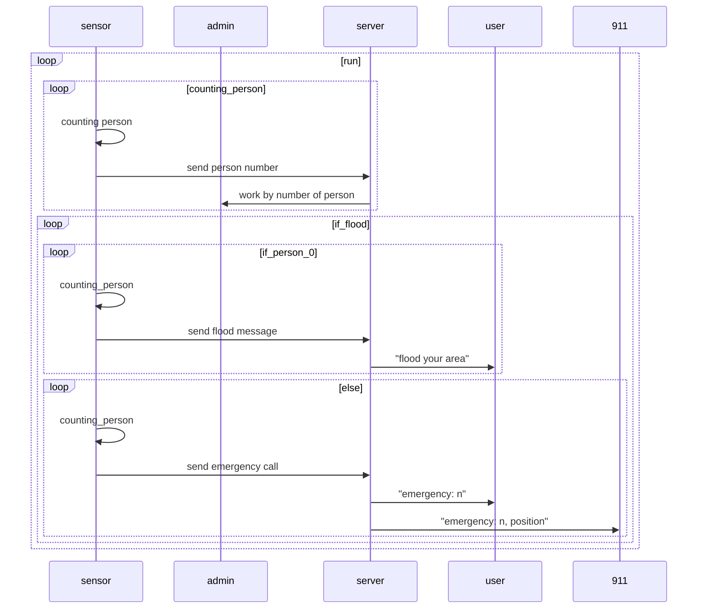

# 재실 관리를 이용한 침수 감지 시스템
이 시스템은 재실관리에 침수감지 센서를 넣어 방 안의 침수를 감지하는 시스템입니다

아두이노(Admin) - test.ino

아두이노(Sensor) - iot_client_bluetooth2.ino

라즈베리파이(Server) - iot_server1.c

라즈베리파이(User or 119) - iot_client1.c

이렇게 구성된 시스템입니다

아두이노(.ino)는 그대로 넣으시면 되고, 
라즈베리파이(.c)는 컴파일 후 실행해야합니다.
*******
//FLOODSENCE QA1.xlsx은 QA용 점검표임 

//QA점검표는 작성후 월/일 FLOODSENCE QA.xlsx파일을 만들어 코드와 함께 날짜 파일로 올릴 것  
//당일 추가 파일을 올릴경우 01,02등을 붙일 것  

// 파일 수정전에 반드시 원본파일을 다운로드한 이후 수정  
// 파일 수정 후에 '반드시' 컴파일 및 테스트해보기  

// 해야할 것   
/*  
0910 -QA문서 수정하고 올림  
0927 -stm32 1차 이식 성공  
1007 -프로젝트 기술서 샘플 업로드 
1012 - QA문서 PDF(4444.pdf)버전 올림  
*/  
*******

